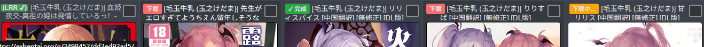

# ExHentai-Lanraragi-Checker
fork and change from https://github.com/Putarku/LANraragi-scripts

Checks if galleries on ExHentai/E-Hentai are already in your Lanraragi library and marks them by inserting a span at the beginning of the title. Adds download button on gallery pages and download link for galleries not found in library. Monitors download progress and clears cache when complete. Supports multiple concurrent downloads.
检查 ExHentai/E-Hentai 上的图库是否已在您的 Lanraragi 库中，如果已存在，则在标题开头插入一个 span 标签进行标记。在图库页面添加下载按钮，并为库中未找到的图库添加下载链接。监控下载进度，并在完成后清除缓存。支持多个并发下载。

# Start
Edit user script after install.
'''
const LRR_SERVER_URL = 'http://127.0.0.1:3000'; // 替换为您的 Lanraragi 服务器地址
const LRR_API_KEY = btoa(''); // 如果您的 Lanraragi API 需要密钥，请填写，自动转为 base64 编码
'''

# Example
